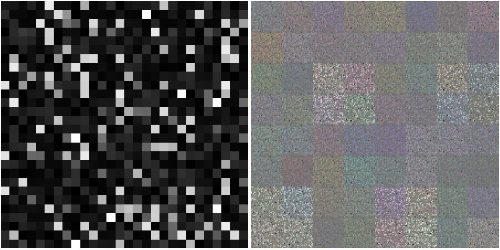

## Abstract

Modern cameras are not designed with computer vision or machine learning as the target application.  There is a need for a new class of vision sensors that are privacy preserving by design, that do not leak private information and collect only the information necessary for a target machine learning task.   In this paper, we introduce key-nets, which are convolutional networks paired with a custom vision sensor which applies an optical/analog transform such that the key-net can perform exact encrypted inference on this transformed image, but the image is not interpretable by a human or any other key-net.  We provide five sufficient conditions for an optical transformation suitable for a key-net, and show that generalized stochastic matrices (e.g. scale, bias and fractional pixel shuffling) satisfy these conditions.  We motivate the key-net by showing that without it there is a utility/privacy tradeoff for a network fine-tuned directly on optically transformed images for face identification and object detection. Finally, we show that a key-net is equivalent to homomorphic encryption using a Hill cipher, with an upper bound on memory and runtime that scales with a user specified privacy parameter. Therefore, the key-net is the first practical, efficient and privacy preserving vision sensor based on optical homomorphic encryption.

[[code]](https://github.com/visym/keynet)    [[paper]](http://arxiv.org)

## Challenge Problem

These images contain a secret message. We will release these images along with their paired keynet to challenge the research community to discover a weakness in semantic security of our proposed approach.

## Citation

**Key-Nets: Optical Transformation Convolutional Networks for Privacy Preserving Vision Sensors**
Jeffrey Byrne, Brian Decann, Scott Bloom  
British Machine Vision Conference (BMVC) 2020 

> @InProceedings{Byrne2020bmvc,  
>     author       = "J. Byrne and B. Decann and S. Bloom",  
>     title        = "Key-Nets: Optical Transformation Convolutional Networks for Privacy Preserving Vision Sensors",  
>     booktitle    = "British Machine Vision Conference (BMVC)",  
>     year         = "2020"  
> }  
    

## Acknowledgement

This material is based upon work supported by the Defense Advanced Research Projects Agency (DARPA) under Contract No. HR001119C0067. 

